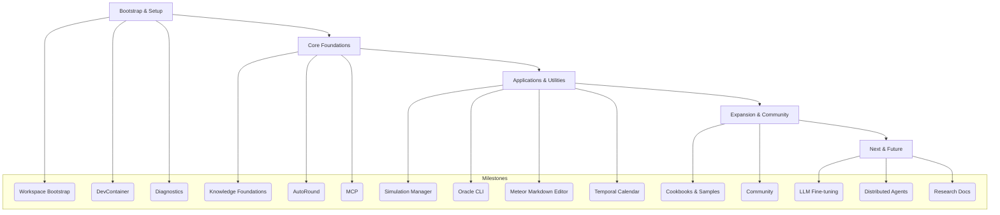
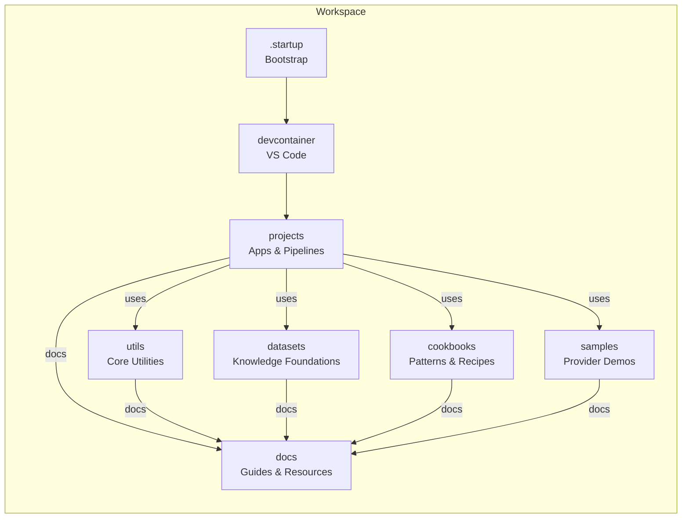

# ArtifactVirtual

## 🚦 Roadmap & Milestones


<svg width="1000" height="800" xmlns="http://www<svg width="1000" height="800" viewBox="0 0 1000 800" xmlns="http://www.w3.org/2000/svg" style="background:#fff; font-family:sans-serif;">
  <style>
    .node { stroke: #000; stroke-width: 1.5; fill: #fff; opacity: 0; animation: fadeSlideIn 1s forwards; }
    .done { fill: #28a745; }
    .active { fill: #ffc107; }
    .planned { fill: #007bff; }
    .text { font-size: 12px; fill: #000; opacity: 0; animation: fadeIn 1s forwards; }
    .badge { font-size: 10px; fill: #fff; text-anchor: middle; opacity: 0; animation: fadeIn 1s forwards; }

    @keyframes fadeIn {
      to { opacity: 1; }
    }

    @keyframes fadeSlideIn {
      from { opacity: 0; transform: translateY(10px); }
      to { opacity: 1; transform: translateY(0); }
    }
  </style>

  <g style="animation-delay: 0s">
    <rect x="40" y="40" width="180" height="30" class="node" />
    <text x="50" y="60" class="text" style="animation-delay: 0.1s">Workspace Bootstrap</text>
    <circle cx="215" cy="55" r="7" class="done" />
    <text x="215" y="59" class="badge" style="animation-delay: 0.2s">D</text>
  </g>

  <g style="animation-delay: 0.3s">
    <rect x="240" y="40" width="200" height="30" class="node" />
    <text x="250" y="60" class="text" style="animation-delay: 0.4s">DevContainer Integration</text>
    <circle cx="435" cy="55" r="7" class="done" />
    <text x="435" y="59" class="badge" style="animation-delay: 0.5s">D</text>
  </g>

  </svg>




---

## Vision & Overview

ArtifactVirtual is a modular, open-source AI workspace and research platform. It brings together advanced LLMs, knowledge foundations, quantization, diagnostics, and agentic workflows—designed for reproducibility, extensibility, and creative exploration.

- **Portable**: Runs natively or in containers, on any major OS
- **Self-initializing**: One-step bootstrap, automated dependency management
- **Composable**: Plug-and-play utilities, cookbooks, and pipelines
- **Research-driven**: Built for experimentation, learning, and sharing

---

## System Architecture



---

## Quickstart

### Automated Setup

```bash
python startup.py
```
- Checks system, installs dependencies, boots core services, and welcomes you interactively.
- See [.startup/readme.md](.startup/readme.md) for details.

### DevContainer (Recommended for VS Code)

1. Open in VS Code, install Remote - Containers extension
2. "Reopen in Container" when prompted
3. Wait for the environment to build and initialize
- See [devcontainer/README.md](devcontainer/README.md) for advanced usage

---

## Project Navigation

- [Getting Started Guide](docs/gettingstarted.md)
- [Troubleshooting Guide](docs/troubleshooting.md)
- [Resources & References](docs/resources.md)
- [Cookbooks](cookbooks/README.md)
- [Datasets](datasets/README.md)
- [Samples](samples/README.md)
- [Utilities](utils/README.md)
- [Projects](projects/)
- [Research & Philosophy](backup/research/index.mdx)

---

## Core Components & Subprojects

- **.startup/** – Portable, self-initializing bootstrap scripts ([.startup/readme.md](.startup/readme.md))
- **devcontainer/** – VS Code DevContainer for reproducible development ([devcontainer/README.md](devcontainer/README.md))
- **utils/** – Core utilities: AutoRound (quantization), DebugDiag (diagnostics), DSPy, Model Context Protocol ([utils/README.md](utils/README.md))
- **cookbooks/** – Ready-to-use patterns and recipes for LLMs, RAG, agents, optimization ([cookbooks/README.md](cookbooks/README.md))
- **datasets/** – Knowledge foundations, curated datasets, and the Library of Immutable Knowledge ([datasets/README.md](datasets/README.md))
- **samples/** – Multilingual, multi-provider LLM samples for OpenAI, Mistral, Azure, Ollama ([samples/README.md](samples/README.md))
- **projects/** – Main applications and research projects:
  - **simulation-manager/**: Adaptive error handling, input unit simulation
  - **oracle-ai-pipeline/**: Multimodal LLM playground, model chaining, plugin system
  - **meteor-markdown-editor/**: AI-enhanced markdown editor with publishing
  - **temporal-calendar/**: Artifact time/calendar system
  - **scarab/**, **black-widow/**: Experimental/utility projects
- **docs/** – Guides, troubleshooting, resources, and research philosophy ([docs/README.md](docs/README.md))
- **backup/research/** – Journal, manifesto, research papers, and technical reference ([backup/research/index.mdx](backup/research/index.mdx))

---

## Milestones & Achievements

- 🚀 **Workspace Bootstrap**: One-step, cross-platform setup with `.startup` and DevContainer
- 🧠 **Knowledge Foundations**: Curated datasets and the Library of Immutable Knowledge
- ⚡ **AutoRound**: Advanced quantization for LLMs, supporting 2-8 bit, mixed precision, and multiple formats
- 🧩 **Model Context Protocol**: Standardized context for LLMs, with server/client libraries and Claude Desktop integration
- 🛠️ **DebugDiag**: Unified diagnostics, logging, and system introspection
- 🧬 **Simulation Manager**: Adaptive error handling, threshold/retry simulation, and dashboard integration
- 📝 **Meteor Markdown Editor**: AI-powered markdown editing, publishing, and GitHub integration
- 🔗 **Oracle CLI**: Multimodal LLM playground, model chaining, plugin system
- 📅 **Temporal Calendar**: Artifact-native time and event system
- 📚 **Cookbooks & Samples**: Dozens of ready-to-use patterns, RAG, agent, and optimization examples
- 🏆 **Community Contributions**: Open source, extensible, and growing with user feedback

---

## Troubleshooting & FAQ

- For common issues, see the [Troubleshooting Guide](docs/troubleshooting.md)
- For setup help, see [Getting Started](docs/gettingstarted.md)
- For DevContainer or Docker issues, see [devcontainer/README.md](devcontainer/README.md)
- For LLM/model issues, see [samples/README.md](samples/README.md) and [utils/README.md](utils/README.md)

---

## Contributing & Community

- Contributions are welcome! See [CONTRIBUTING.md](CONTRIBUTING.md) or the contributing section in each subproject.
- Join discussions on [GitHub Discussions](https://github.com/amuzetnoM/artifactvirtual/discussions)
- For research, philosophy, and technical deep dives, see [backup/research/index.mdx](backup/research/index.mdx)

---

## License & Credits

ArtifactVirtual is licensed under the MIT License. See [LICENSE](LICENSE) for details.

Special thanks to all contributors, open-source projects, and the AI research community.

---
