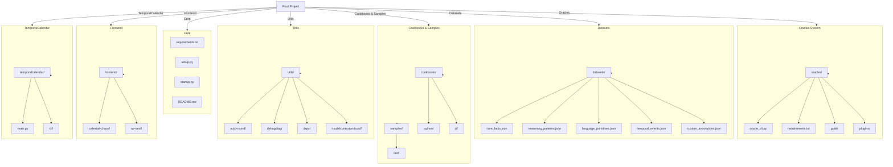

# ArtifactVirtual: AI Workspace & Oracles System

> Please note: 
If you're looking for the development please switch to the devops branch.

This isn't a product. It’s a paradox in motion. AV is a testament to resilinece. A living archive and a futureborn ecosystem. It’s built for strangeness, its built for the surreal. Its envisioned for free thinkers, visionaries and didacts, the alchemists of meaning. And for those who’ve learned to swim (or drown) in uncertainty with grace. On its surface, Artifact Virtual aims to be a platform: a nexus of creators, a centre for code, a temple of knowledge and art. But at its core, it's quite deliberate. Its a confrontation with noise and nihilism. A collision course with Norman, the antagonist. It exists to distill signal from entropy and meaning from machinery.

Here, creation is not simply an output. It is revelation. Every thought, every idea, every actuon is treated like an artifact. A vessel of intent, an echo of purpose, forged not just to core function, but to endure and persevere. The word "Virtual" isn't a concession to illusion but a mirror into infinite potential and the shear width of the mind. 

*what could be, if you had the right tools and merely a thought that aligned truly, absolutely?*

Artifact is a challenge.
It seeks wisdom, not just knowledge; economy, not just money; emergence, not just virality. It is where technology remembers its soul and it's creator.

At the edge of chaos, Artifact Virtual operates as a scalpel, skimming away the bloated excess of mainstream digital life to expose the raw nerve of what lies behind. 
A truth, beautiful yet irresponsible. 

*...but isn't all life? Everything ever created?*

We are not here to merge, we are here to fork. 
We are here to question, questions and dissecting knowledge to trace its origin. To advocate the real against the belief. 

We are a rebellion against stagnation, against whats known, whats believed. 
A framework of thinking, and evolving.

We are not here to replicate the past.  
We are here to create new worlds: knowledge systems, thinking machines, and architectures for a freer future.

This is Day 1.  
This is ReGenesis.

Today, an idea is born.
> Tomorrow, it will grow. 

### Vision

Artifact exists to:

- Create structured, causal knowledge systems — built for reasoning, not storage.
- Architect modular AI ecosystems — resilient, autonomous, and open.
- Forge tools that empower creation, not dependence.
- Design digital environments where builders think, imagine, and execute at the speed of thought.
- 

### ARTIFACT DEVELOPMENT ENGINE

#### Current Focus

- ReGen Journal: Raw, unfiltered frameworks and thoughts.
- Knowledge Frameworks: Building the first structured knowledge assets.
- RAG Systems: Real-time, inference-driven AI retrieval methods.
- LangGraph Agents: Modular planning, reasoning, execution and abstraction.
- Visual Intelligence: Dynamic visualizations of systems, codebases, and ideas.

AV and ADE are designed for those who intend to **own their creations**, 
**master their tools**, and 
**forge entire realities.**

This is not a product.  
This is a weapon for creation, a tool of thought.

>                                                and quite honestly, a lot more...

> This branch is established to jump into a playground of thought and reason.
> Here you will find a journal and a manifesto of however all this emerged. (progressively evolving and, at time, questionable)
> All journal entries are planned to reside inside `/content/journal/`.

> To review and contribute to the development, please switch to the devops branch.

     to be seen, is to cease to be.

