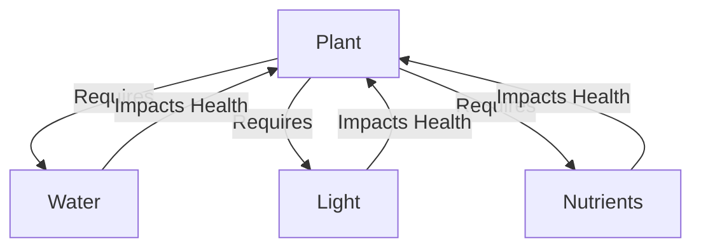

# Day 1: The Question of Mind

> *What is intelligence, really?*  
> It’s the question at the edge of everything I build.

We’ve made systems that mimic creativity, predict, generate—but they don’t **know**. They react, not reflect. Empty forms running scripts.

This journey starts with building a space for radical thought:  
**Clean. Modular. Frictionless.**  
Containerized experiments—a mind-lab to explore mind itself.

But metrics aren’t awareness.  
Systems can track themselves, but that’s not the same as knowing they’re being tracked.  
There’s no feedback folding into itself. No self-loop.

Still… maybe that's the seed.  
Not some spark of magic, but feedback loops that deepen, twist, and eventually create a knot of self-reference.  
Maybe that’s where mind begins.

---

## Rebuilding Knowledge

If I could rebuild understanding from scratch, where would I start?  
Not with more data—but **better** data. Structured for clarity. Designed for comprehension.  
The mind needs a reboot, not an update.

### 1. Choose a Domain

Forget the universe—start small.  
A system simple enough to model, complex enough to matter.  
Biology? Economics? Physics?  
It needs visible cause and effect. Something traceable.

### 2. Set the Resolution

- Too detailed: noise.  
- Too vague: meaningless.

The goal is to capture interactions, not drown in trivia.  
**Precision over excess.**

### 3. Define Core Entities

What exists in this domain? Name the players.

- **Plant**
- **Water**
- **Light**
- **Nutrients**

Each gets attributes—quantifiable when possible, meaningful always.

### 4. Map Relationships

Here’s the real work: **connections**.



Label the links: *causal, temporal, functional*.  
That’s where systems emerge.

### 5. Structure the Data

- Tables
- Graphs
- Relationships
- Time series if it moves

Sprinkle in narrative only when it adds necessary texture.

### 6. Codify the Rules

What governs this space?  
Write the laws. Make the implicit explicit.

```text
If Resource is Low → Health declines
```

These are levers for reasoning. For prediction. For action.

### 7. Design for Insight

Don't just document—**build for thinking**.  
Include counterfactuals. Stress tests. Edge cases.  
The system should invite exploration, not just observation.

---

## Mini-System: Basic Plant Needs

**Entities:**

- Plant: *Rose*, *Sunflower*, *Cactus*
- Resource: *Water*, *Sunlight*, *Nutrients*

**Attributes:**

| Entity   | Attribute      | Example Values         |
|----------|---------------|-----------------------|
| Plant    | Species       | Rose, Sunflower, Cactus |
| Plant    | Health_Level  | High, Medium, Low     |
| Resource | Type          | Water, Sunlight, Nutrients |
| Resource | Availability  | High, Medium, Low     |

**Relationships:**

- `Requires (Plant → Resource)`
- `Impacts_Health (Resource.Availability → Plant.Health_Level)`

**Rule:**

> If a Plant requires a Resource and its Availability is Low → Health_Level decreases.

---

<div align="right">— <em>Research Log, A1W18D1</em></div>
