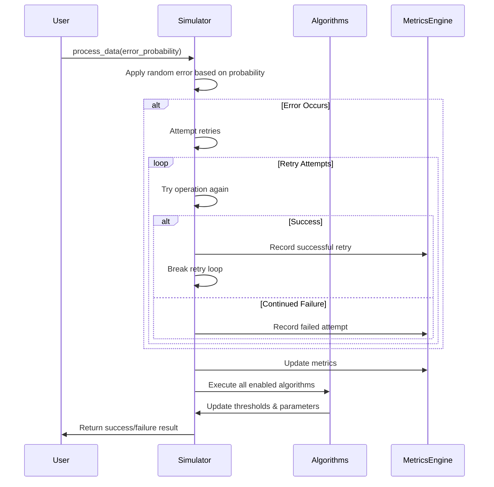
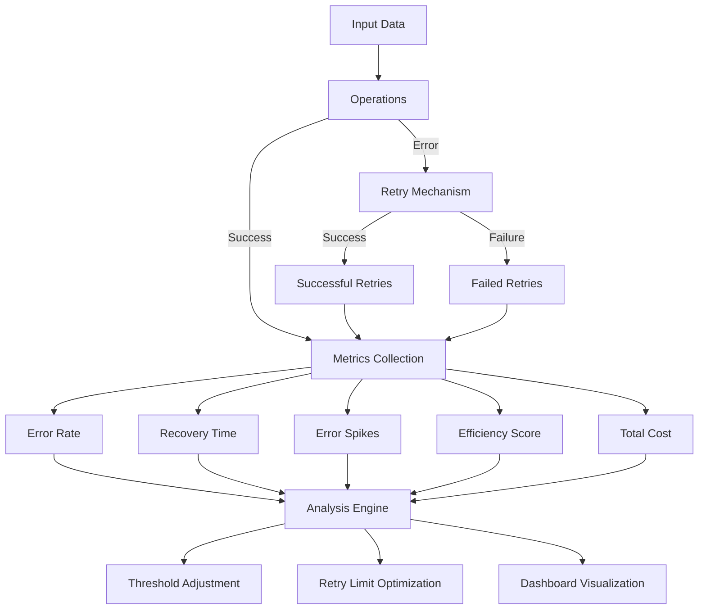

# InputUnitSim - Advanced Adaptive Error Handling Simulator

## Simulation Architecture & Workflows

### System Architecture
```mermaid
flowchart TD
    classDef core fill:#f96,stroke:#333,stroke-width:2px
    classDef algorithms fill:#9cf,stroke:#333,stroke-width:2px
    classDef metrics fill:#9f6,stroke:#333,stroke-width:2px
    classDef viz fill:#f9f,stroke:#333,stroke-width:2px

    Core[Core Simulator Engine] :::core
    SM[Strategy Manager] :::core
    MC[Metrics Collection] :::metrics
    VM[Visualization Module] :::viz
    
    %% Algorithm categories
    TA[Threshold Algorithms] :::algorithms
    RA[Retry Algorithms] :::algorithms
    EA[Efficiency Algorithms] :::algorithms
    CA[Cost Model Algorithms] :::algorithms
    EXT[External Dashboards]

    Core <--> SM
    SM <--> TA & RA & EA & CA
    Core --> MC
    MC --> VM
    VM --> EXT
```

### Processing Workflow


### Adaptive System Logic Flow
```
┌─────────────────────────────────┐
│ 1. Initialize System Parameters │
└───────────────┬─────────────────┘
                │
                ▼
┌─────────────────────────────────┐
│ 2. Process Input with           │
│    Error Probability            │
└───────────────┬─────────────────┘
                │
                ▼
┌─────────────────────────────────┐
│ 3. Calculate Current Error Rate │
└───────────────┬─────────────────┘
                │
                ▼
        ┌───────┴─────────────┐
        │                     │
        ▼                     ▼
┌────────────────┐   ┌─────────────────┐
│Error > Threshold│   │Error ≤ Threshold│
└───────┬────────┘   └────────┬────────┘
        │                     │
        ▼                     ▼
┌────────────────┐   ┌───────────────────┐
│Increase Retries │   │Decrease Retries  │
│Decrease Threshold   │Increase Threshold|
└───────┬────────┘   └────────┬──────────┘
        │                     │
        └─────────┬───────────┘
                  │
                  ▼
┌─────────────────────────────────┐
│ 4. Update Advanced Metrics      │
└───────────────┬─────────────────┘
                │
                ▼
┌─────────────────────────────────┐
│ 5. Execute Custom Algorithms    │
└───────────────┬─────────────────┘
                │
                ▼
┌─────────────────────────────────┐
│ 6. Visualize Results            │
└─────────────────────────────────┘
```

### Metrics Flow


## Overview
InputUnitSim is a sophisticated simulation framework for modeling and testing adaptive error handling systems. It provides a comprehensive environment to evaluate how different error handling strategies perform under varying error conditions, with a focus on dynamic threshold adjustment and retry optimization.

## Features
- **Dynamic Error Threshold Adjustment**: Automatically adapts acceptable error thresholds based on runtime conditions
- **Adaptive Retry Limit Optimization**: Intelligently adjusts retry attempts based on current error rates and success patterns
- **Pluggable Algorithm Architecture**: Extend functionality with custom algorithms through a modular design
- **Comprehensive Metrics Collection**: Detailed performance analytics including error rates, recovery times, and efficiency scores
- **Cost Modeling**: Sophisticated cost calculations considering operation costs, retries, errors, latency, and resource usage
- **Real-time Visualization**: Interactive plots showing system behavior and performance metrics
- **Interactive Configuration**: Adjust simulation parameters in real-time to test different scenarios

## Quick Start
```python
from InputUnitSim.inputunit import EnhancedInputUnitSimulator
from InputUnitSim.script import run_simulation, create_plotly_visualization

# Run a simulation with default parameters
results = run_simulation(steps=1000)

# Create and display interactive visualization
fig = create_plotly_visualization(results)
fig.show()
```

## Advanced Usage

### Custom Simulation Configuration
```python
# Create simulator with custom parameters
simulator = EnhancedInputUnitSimulator(
    initial_threshold=0.04,    # Starting error threshold
    adjustment_step=0.0005,    # How quickly thresholds adjust
    initial_retry_limit=5,     # Starting retry attempt limit
    window_size=200,           # Size of sliding window for error rate calculation
    adaptation_rate=0.08,      # How quickly system adapts to changing conditions
    max_retry_limit=12,        # Maximum allowed retry attempts
    min_retry_limit=1          # Minimum allowed retry attempts
)

# Run simulation with varying error probabilities
for i in range(1000):
    # Simulate changing conditions with different error probabilities
    error_prob = 0.02 if i < 500 else 0.09
    success = simulator.process_data(error_prob)
    
    # Access current metrics
    if i % 100 == 0:
        metrics = simulator.get_metrics()
        print(f"Step {i}: Error Rate = {metrics['current_error_rate']:.4f}, "
              f"Threshold = {metrics['acceptable_threshold']:.4f}, "
              f"Retry Limit = {metrics['retry_limit']}")
```

### Customizing Algorithms
```python
# Access and modify existing algorithms
adaptive_threshold = simulator.get_algorithm("adaptive_threshold")
adaptive_threshold.set_parameter("aggressive_factor", 12.0)
adaptive_threshold.set_parameter("min_threshold", 0.002)

# Disable an algorithm
simulator.enable_algorithm("momentum_threshold", False)

# Create and add a custom algorithm
from InputUnitSim.inputunit import Algorithm

class MyCustomAlgorithm(Algorithm):
    def __init__(self):
        parameters = {
            'category': 'custom',
            'my_parameter': 1.0
        }
        super().__init__(
            "my_algorithm", 
            "My custom algorithm implementation",
            parameters
        )
        
    def execute(self, simulator, *args, **kwargs):
        # Implement custom logic here
        return my_result
        
simulator.add_custom_algorithm(MyCustomAlgorithm())
```

### Interactive Simulation
```python
from InputUnitSim.inputunit import EnhancedInputUnitSimulator, SimulationRunner

# Create simulator
simulator = EnhancedInputUnitSimulator()

# Run interactive simulation with controls
runner = SimulationRunner(simulator, initial_error_probability=0.03)
runner.start()
```

## API Reference
See the [System Mapping](systemmapping.md) document for a complete reference of all classes, methods, parameters, and components.

## Dashboard Integration
The simulator supports integration with external monitoring dashboards through its comprehensive metrics API. See the [System Mapping](systemmapping.md) document for available endpoints and integration points.

## Performance Considerations
- For long-running simulations (>100,000 steps), consider using the `window_size` parameter to control memory usage
- Visualization performance may degrade with large datasets; use the Plotly export functions to generate static reports for very large simulations
- Algorithm performance can be monitored through the `get_metrics()` function

## License
This project is licensed under the MIT License - see the LICENSE file for details.

## Contributing
Contributions are welcome! Please see the CONTRIBUTING.md file for guidelines.

